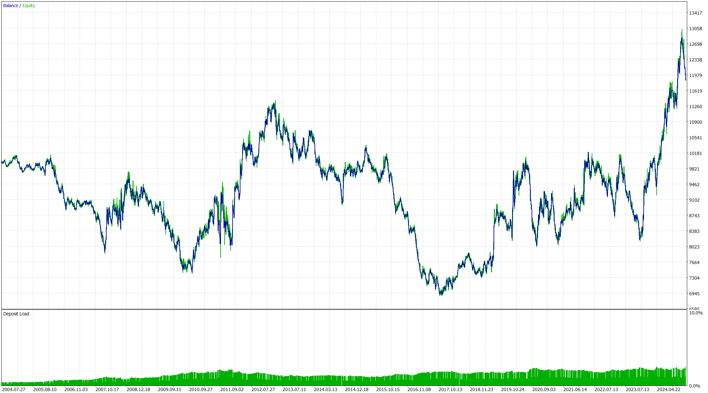

# PB-Bollinger-EA

**PB-Bollinger-EA** là một bot giao dịch tự động được thiết kế để giao dịch vàng (XAU/USD) hoặc các cặp tiền tệ khác trên khung thời gian 4 giờ (H4). Bot sử dụng chỉ báo Bollinger Bands kết hợp với mô hình nến Pin Bar để xác định điểm vào lệnh theo chiến lược xu hướng đảo chiều.

- **Mua**: Khi xuất hiện nến Pin Bar tăng (bullish Pin Bar) chạm dải dưới của Bollinger Bands.  
- **Bán**: Khi xuất hiện nến Pin Bar giảm (bearish Pin Bar) chạm dải trên của Bollinger Bands.

## Tính năng chính
- **Phát hiện Pin Bar**: Bot tự động nhận diện mô hình nến Pin Bar dựa trên giá mở, đóng, cao và thấp của nến trước đó.  
- **Bollinger Bands**: Sử dụng dải Bollinger (20 chu kỳ, độ lệch 2) để xác định vùng giá quá mua hoặc quá bán, làm cơ sở kích hoạt lệnh.  
- **Quản lý lệnh**: Mở hai lệnh với kích thước lô tùy chỉnh (mặc định 0.05 lot), đặt Stop Loss dựa trên mức thấp nhất (cho lệnh mua) hoặc cao nhất (cho lệnh bán) của nến Pin Bar, Take Profit 1 khi giá chạm dải giữa, Take Profit 2 khi giá chạm dải trên đối với lệnh bán và chạm dải dưới đối với lệnh mua.
- **Điều chỉnh Stop Loss**: Tự động di chuyển Stop Loss về điểm vào lệnh khi Take Profit 1, giúp bảo toàn vốn.

## Mục đích sử dụng
PB-Bollinger-EA là công cụ lý tưởng cho những nhà giao dịch muốn tự động hóa chiến lược giao dịch đảo chiều dựa trên Pin Bar và Bollinger Bands trên khung H4.

## Yêu cầu  
- **Cặp tiền**: XAU/USD (vàng) hoặc các cặp tiền tệ khác.  
- **Khung thời gian**: H4 (4 giờ).   

## Lưu ý
- **Kiểm tra trước**: Hãy chạy thử trên tài khoản demo để đảm bảo bot hoạt động đúng với chiến lược của bạn.  
- **Quản lý vốn**: Điều chỉnh kích thước lô (`lotSize`) phù hợp với số dư tài khoản để giảm rủi ro.

## Ví dụ minh họa
Kết quả thử nghiệm bot trên cặp XAU/USD (vàng) tại khung thời gian H4 với **entire history**.

